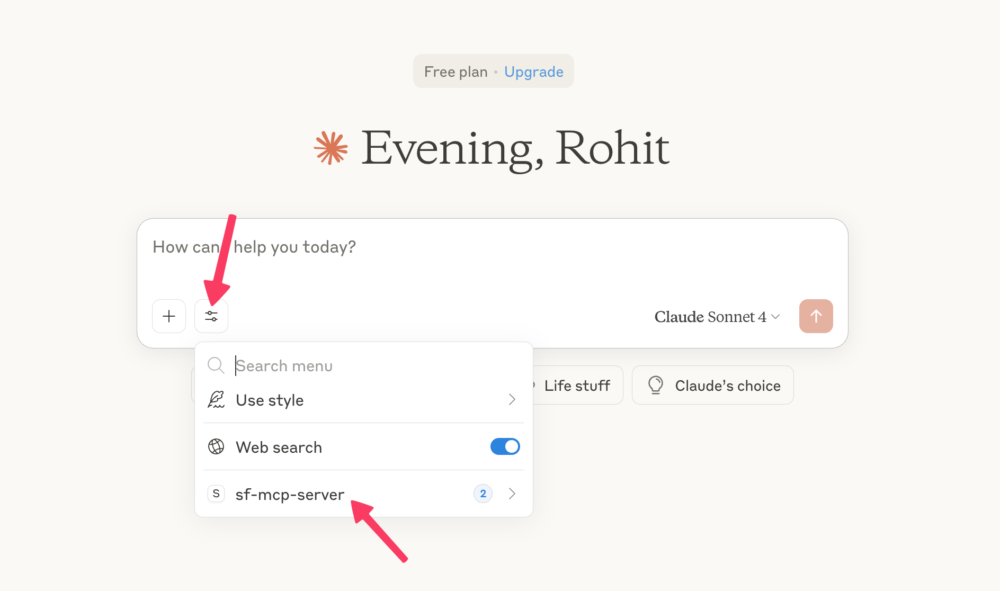
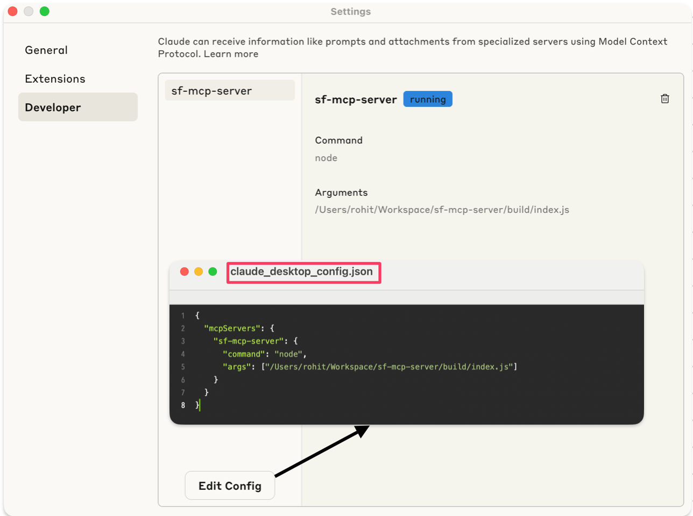

# sf-mcp-server

A Model Context Protocol (MCP) server for Salesforce, enabling programmatic access to Salesforce orgs and data via the MCP standard.

## Features

- List all connected Salesforce orgs using the Salesforce CLI (`sf org list`).
- Execute SOQL queries against a specified Salesforce org using the Salesforce CLI (`sf data query`).
- Exposes these capabilities as MCP tools for integration with MCP clients.

## Requirements

- Node.js (v18 or higher recommended)
- Salesforce CLI (`sf`) installed and authenticated with your Salesforce orgs

## Installation

1. Clone this repository:
   ```sh
   git clone <repo-url>
   cd sf-mcp-server
   ```
2. Install dependencies:
   ```sh
   npm install
   ```

## Usage

You can run the MCP server using Node.js:

```sh
npm start
```

Or directly:

```sh
node build/index.js
```

The server will start and listen for MCP requests over stdio.

## Claude Configuration

To use Claude with this MCP server, configure your Claude client as follows:

1. Set the MCP server endpoint to the location where this server is running (usually stdio or a local port if you adapt the transport).
2. Ensure your Salesforce CLI is authenticated and accessible from the environment where the server runs.
3. Use the provided MCP tools (`list_connected_salesforce_orgs` and `query_records`) from your Claude or MCP-compatible client.

### Example Claude Client Configuration

- **MCP Server Endpoint:** `local` (or specify the port if using a network transport)
- **Tooling:**
  - `list_connected_salesforce_orgs`
  - `query_records`

Refer to your Claude client documentation for details on connecting to a local MCP server.

## Images

Below are example images for configuration and usage:




## MCP Tools

### 1. `list_connected_salesforce_orgs`

Lists all Salesforce orgs connected via the Salesforce CLI.

### 2. `query_records`

Executes a SOQL query against a specified Salesforce org.

**Input fields:**

- `targetOrg`: Target Salesforce Org alias or username
- `sObject`: Salesforce SObject to query from
- `fields`: Comma-separated list of fields to retrieve
- `where`: (Optional) WHERE clause
- `orderBy`: (Optional) ORDER BY clause
- `limit`: (Optional) Limit for the number of records returned

## Development

- Source code is in the `src/` directory.
- Build output is in the `build/` directory.
- To build the project:
  ```sh
  npm run build
  ```

## License

MIT
